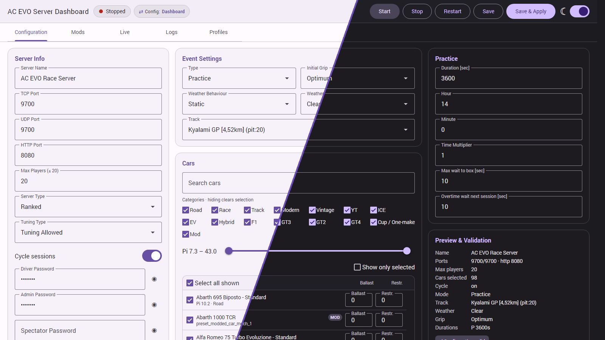

# Assetto Corsa EVO Dedicated Server

[](LICENSE)
[](https://github.com/zino1337/acevo-server/actions/workflows/ci.yml)
[](https://hub.docker.com/r/zino1337/acevo-server)
[](https://hub.docker.com/r/zino1337/acevo-server)
[](https://github.com/zino1337/acevo-server)

<p align="center">
  
</p>

Highly customizable Assetto Corsa Evo Dedicated Server running on Linux via Proton.<br/>
Configure server and event settings via environment variables, web dashboard or server_launcher.json.<br/>
Copy `.env.example` to `.env` and start with Docker Compose.<br/>
Not affiliated with Kunos Simulazioni or Assetto Corsa.

## Features

- Web dashboard to configure and control the server, including a live driver overview
- Mod support
- Environment variables or server_launcher.json for easy server configuration
- SteamCMD auto-update
- Practice and Race Weekend support
- Linux server via Proton
- Headless deployment by default - no GPU needed
- Host user/group mapping for volumes

## Requirements

- Docker and Docker Compose
- Steam account owning [Assetto Corsa EVO](https://store.steampowered.com/app/3058630/Assetto_Corsa_EVO/)
- Recommended: 2 CPU cores and 4 GiB RAM or more

## Quickstart

```bash
git clone https://github.com/zino1337/acevo-server.git
cd acevo-server
cp .env.example .env
```

Set `STEAM_USERNAME` to your Steam account name (not your email).<br/>
Set `STEAM_PASSWORD` before first start.<br/>

First login may fail when Steam Guard sends a code.<br/>
Put the code into `STEAM_AUTH_CODE` and run `docker compose up -d` again.

```bash
docker compose up -d
```

## Volumes

The Steam volume keeps SteamCMD login state so Steam Guard is not required on every restart of the server.

| Volume / Path                | Description                                                                 |
| ---------------------------- | --------------------------------------------------------------------------- |
| `/data`                      | Persistent server data, saves, and generated config files                   |
| `/data/mods`                 | Persistent `.kspkg` car mods (also available as `./volumes/data/mods`)      |
| `/root/.local/share/Steam`   | SteamCMD cache and login state                                              |
| `/data/server_launcher.json` | Optional official Windows launcher config loaded via `SERVER_LAUNCHER_JSON` |

Environment variables have priority by default. **Save** alone does not change that priority. **Save & Apply** activates
Dashboard priority, so saved `server_launcher.json` values override conflicting dashboard-managed variables. Operational
settings such as Steam credentials, dashboard auth, update controls, and paths always remain ENV-based. When both sources
exist, the header shows the active priority and lets you switch back without deleting either configuration.

## Ports

`SERVER_TCP_PORT` and `SERVER_UDP_PORT` can be changed, but both must use the same port value or clients cannot connect.

| Port   | Protocol | Default | Purpose           |
| ------ | -------- | ------- | ----------------- |
| `9700` | TCP      | yes     | Server TCP port   |
| `9700` | UDP      | yes     | Server UDP port   |
| `8080` | TCP      | yes     | HTTP/listing port |
| `8090` | TCP      | yes     | Web dashboard     |

## Web Dashboard

Just open **`http://<host>:8090`** in a browser (change the port with `DASHBOARD_PORT`). Protect it by setting `DASHBOARD_USER` / `DASHBOARD_PASSWORD` (an empty password makes it public).

From the dashboard you can:

- Configure server and event settings visually — server name, ports, passwords, cars, track, weather etc.
- Install and remove `.kspkg` car mods from the **Mods** tab
- Start/Stop/Restart the server
- Watch live logs

> **Windows:** start the stack with `docker compose -f docker-compose.winvol.yml up -d` instead.

## Mod Support

AC EVO supports modded cars in multiplayer. Every driver needs exactly the same mod file as the server; otherwise, AC
EVO rejects the connection.

1. Open **Mods**, upload a `.kspkg` file, and click **Install**. Car variants are detected automatically.
2. Open the **Configuration** tab, select the newly added car, and click **Save & Apply**.
3. Every driver must install the exact same `.kspkg` locally at `%USERPROFILE%\Saved Games\ACE\mods` before joining.

If an upload is interrupted, select the same file again within 24 hours and click **Install** to resume it.

Without the dashboard, stop the server and copy `.kspkg` files to `./volumes/data/mods` (`/data/mods` inside the
container).

Only `.kspkg` car mods are managed. Additional SDK JSON files are not required and remain untouched in the volume. Cars
and variants are identified by their mechanical preset IDs inside the package; invalid packages and conflicting IDs
are not added to the car selector. An explicit `EVENT_CARS=all` also includes all conflict-free installed mods.

## Docker Compose Examples

```bash
# Practice server
docker compose up -d

# Race Weekend server
docker compose -f docker-compose-race.yml up -d
```

## Environment Variables

Set or adjust in `.env` or in the docker compose file.

| Name                                             | Default                        | Type    | Description                                                                                                    |
| ------------------------------------------------ | ------------------------------ | ------- | -------------------------------------------------------------------------------------------------------------- |
| `ACEVO_FORCE_SOFTWARE_RENDERING`                 | `true`                         | boolean | Forces Proton/WineD3D and Mesa llvmpipe software rendering for broad no-GPU host compatibility.                |
| `AUTO_START_SERVER`                              | `true`                         | boolean | Start the AC EVO server automatically when the container starts (the dashboard can stop/restart it).           |
| `AUTO_UPDATE`                                    | `true`                         | boolean | Updates the dedicated server once when the container starts; dashboard server restarts skip the update.        |
| `DASHBOARD_PASSWORD`                             | empty                          | string  | Web dashboard Basic Auth password; empty disables auth (public). See the Web Dashboard section.                |
| `DASHBOARD_PORT`                                 | `8090`                         | integer | Port the web dashboard listens on.                                                                             |
| `DASHBOARD_USER`                                 | `admin`                        | string  | Web dashboard Basic Auth username.                                                                             |
| `PGID`                                           | `0`                            | integer | Group ID used for mounted volume ownership.                                                                    |
| `PUID`                                           | `0`                            | integer | User ID used for mounted volume ownership.                                                                     |
| `SERVER_LAUNCHER_JSON`                           | `/data/server_launcher.json`   | path    | Optional official tool config. ENV has priority by default; Dashboard **Save & Apply** can switch precedence.  |
| `SERVER_ADMIN_PASSWORD`                          | empty                          | string  | Admin password.                                                                                                |
| `SERVER_CYCLE_ENABLED`                           | `true`                         | boolean | Enables session/event cycling when supported by the server.                                                    |
| `SERVER_DRIVER_PASSWORD`                         | empty                          | string  | Driver password.                                                                                               |
| `SERVER_ENTRY_LIST_PATH`                         | empty                          | path    | Local entry list JSON path passed to the server.                                                               |
| `SERVER_ENTRY_LIST_URL`                          | empty                          | URL     | Remote entry list JSON URL passed to the server.                                                               |
| `SERVER_HTTP_PORT`                               | `8080`                         | integer | HTTP/listing port exposed by the server.                                                                       |
| `SERVER_MAX_PLAYERS`                             | `20`                           | integer | Maximum player slots; downscaled to the selected track maximum if configured too high.                         |
| `SERVER_NAME`                                    | `AC EVO Nordschleife Trackday` | string  | Public server name.                                                                                            |
| `SERVER_RESULTS_POST_URL`                        | empty                          | string  | Experimental native result POST endpoint; include auth as query params if needed.                              |
| `SERVER_RESULTS_PATH`                            | empty                          | path    | Local results output folder passed to the server.                                                              |
| `SERVER_SPECTATOR_PASSWORD`                      | empty                          | string  | Spectator password.                                                                                            |
| `SERVER_TCP_PORT`                                | `9700`                         | integer | TCP listener port.                                                                                             |
| `SERVER_TYPE`                                    | `Ranked`                       | enum    | Server type: `Ranked` or `Unranked`.                                                                           |
| `SERVER_TUNING_TYPE`                             | `TuningAllowed`                | enum    | Tuning filter: `TuningAllowed` or `TuningDenied`.                                                              |
| `SERVER_UDP_PORT`                                | `9700`                         | integer | UDP listener port.                                                                                             |
| `STEAM_VALIDATE`                                 | `false`                        | boolean | Validates Steam files during update.                                                                           |
| `STEAM_AUTH_CODE`                                | empty                          | string  | Optional Steam Guard auth code for the next SteamCMD login.                                                    |
| `STEAM_PASSWORD`                                 | empty                          | string  | Required Steam account password for SteamCMD.                                                                  |
| `STEAM_USERNAME`                                 | empty                          | string  | Required Steam account name, not email.                                                                        |
| `EVENT_BAN_CARS`                                 | empty                          | list    | Comma-separated car names/substrings from [Cars](#cars) to remove, e.g. `Ferrari_SF_25,Ferrari_F2004`.         |
| `EVENT_BAN_CAR_CATEGORY`                         | empty                          | list    | Comma-separated filters from [Car Categories](#car-categories) to remove, e.g. `EV,Race`.                      |
| `EVENT_CARS`                                     | `all`                          | list    | Comma-separated car names/substrings from [Cars](#cars), or `all`.                                             |
| `EVENT_CAR_CATEGORY`                             | `all`                          | list    | Car filters from [Car Categories](#car-categories): `all`, type, era, or engine categories.                    |
| `EVENT_INITIAL_GRIP`                             | `Optimum`                      | enum    | Initial grip: `Green`, `Fast`, or `Optimum`.                                                                   |
| `EVENT_TRACK`                                    | `Nurburgring_Touristenfahrten` | string  | Track token from [Tracks](#tracks).                                                                            |
| `EVENT_TYPE`                                     | `Practice`                     | enum    | Event mode: `Practice` or `Race_Weekend`.                                                                      |
| `EVENT_WEATHER`                                  | `Clear`                        | enum    | Weather: `Clear`, `Scattered_Clouds`, `Broken_Clouds`, `Overcast`, `Drizzle`, `Rain`, `Heavy_Rain`, or `Damp`. |
| `EVENT_WEATHER_BEHAVIOUR`                        | `Static`                       | enum    | Weather behavior: `Static` or `Dynamic`.                                                                       |
| `PRACTICE_YEAR`                                  | `2024`                         | integer | Practice start year.                                                                                           |
| `PRACTICE_MONTH`                                 | `8`                            | integer | Practice start month.                                                                                          |
| `PRACTICE_DAY`                                   | `15`                           | integer | Practice start day.                                                                                            |
| `PRACTICE_DURATION_MINUTES`                      | `180`                          | integer | Practice duration in minutes.                                                                                  |
| `PRACTICE_HOUR`                                  | `14`                           | integer | Practice start hour.                                                                                           |
| `PRACTICE_MAX_WAIT_TO_BOX_SECONDS`               | `10`                           | integer | The max time to complete the flying lap and go back to the pit.                                                |
| `PRACTICE_MINUTE`                                | `0`                            | integer | Practice start minute.                                                                                         |
| `PRACTICE_OVERTIME_WAITING_NEXT_SESSION_SECONDS` | `10`                           | integer | The waiting time for the next session.                                                                         |
| `PRACTICE_TIME_MULTIPLIER`                       | `1`                            | integer | In-game time multiplier.                                                                                       |
| `QUALIFY_YEAR`                                   | `2024`                         | integer | Qualify start year, used for `Race_Weekend`.                                                                   |
| `QUALIFY_MONTH`                                  | `8`                            | integer | Qualify start month, used for `Race_Weekend`.                                                                  |
| `QUALIFY_DAY`                                    | `15`                           | integer | Qualify start day, used for `Race_Weekend`.                                                                    |
| `QUALIFY_DURATION_MINUTES`                       | `10`                           | integer | Qualify duration in minutes, used for `Race_Weekend`.                                                          |
| `QUALIFY_HOUR`                                   | `16`                           | integer | Qualify start hour, used for `Race_Weekend`.                                                                   |
| `QUALIFY_MAX_WAIT_TO_BOX_SECONDS`                | `10`                           | integer | The max time to complete the flying lap and go back to the pit, used for `Race_Weekend`.                       |
| `QUALIFY_MINUTE`                                 | `0`                            | integer | Qualify start minute, used for `Race_Weekend`.                                                                 |
| `QUALIFY_OVERTIME_WAITING_NEXT_SESSION_SECONDS`  | `10`                           | integer | The waiting time for the next session, used for `Race_Weekend`.                                                |
| `QUALIFY_TIME_MULTIPLIER`                        | `1`                            | integer | In-game time multiplier, used for `Race_Weekend`.                                                              |
| `WARMUP_YEAR`                                    | `2024`                         | integer | Warmup start year, used for `Race_Weekend`.                                                                    |
| `WARMUP_MONTH`                                   | `8`                            | integer | Warmup start month, used for `Race_Weekend`.                                                                   |
| `WARMUP_DAY`                                     | `15`                           | integer | Warmup start day, used for `Race_Weekend`.                                                                     |
| `WARMUP_DURATION_MINUTES`                        | `5`                            | integer | Warmup duration in minutes, used for `Race_Weekend`.                                                           |
| `WARMUP_HOUR`                                    | `16`                           | integer | Warmup start hour, used for `Race_Weekend`.                                                                    |
| `WARMUP_MAX_WAIT_TO_BOX_SECONDS`                 | `10`                           | integer | The max time to complete the flying lap and go back to the pit, used for `Race_Weekend`.                       |
| `WARMUP_MINUTE`                                  | `0`                            | integer | Warmup start minute, used for `Race_Weekend`.                                                                  |
| `WARMUP_OVERTIME_WAITING_NEXT_SESSION_SECONDS`   | `10`                           | integer | The waiting time for the next session, used for `Race_Weekend`.                                                |
| `WARMUP_TIME_MULTIPLIER`                         | `1`                            | integer | In-game time multiplier, used for `Race_Weekend`.                                                              |
| `RACE_YEAR`                                      | `2024`                         | integer | Race start year, used for `Race_Weekend`.                                                                      |
| `RACE_MONTH`                                     | `8`                            | integer | Race start month, used for `Race_Weekend`.                                                                     |
| `RACE_DAY`                                       | `15`                           | integer | Race start day, used for `Race_Weekend`.                                                                       |
| `RACE_DURATION_MINUTES`                          | `25`                           | integer | Race duration in minutes when `RACE_DURATION_TYPE=Time`.                                                       |
| `RACE_DURATION_LAPS`                             | `10`                           | integer | Race duration in laps when `RACE_DURATION_TYPE=Laps`.                                                          |
| `RACE_DURATION_TYPE`                             | `Time`                         | enum    | Race duration mode: `Time` or `Laps`.                                                                          |
| `RACE_MIN_WAITING_FOR_PLAYERS_SECONDS`           | `10`                           | integer | The minimum wait to start the race.                                                                            |
| `RACE_MAX_WAITING_FOR_PLAYERS_SECONDS`           | `60`                           | integer | The maximum wait to start the race; clamped up to min if smaller.                                              |
| `RACE_HOUR`                                      | `16`                           | integer | Race start hour, used for `Race_Weekend`.                                                                      |
| `RACE_MAX_WAIT_TO_BOX_SECONDS`                   | `60`                           | integer | The max time to complete the flying lap and go back to the pit, used for `Race_Weekend`.                       |
| `RACE_MINUTE`                                    | `0`                            | integer | Race start minute, used for `Race_Weekend`.                                                                    |
| `RACE_OVERTIME_WAITING_NEXT_SESSION_SECONDS`     | `10`                           | integer | The waiting time for the next session, used for `Race_Weekend`.                                                |
| `RACE_TIME_MULTIPLIER`                           | `1`                            | integer | In-game time multiplier, used for `Race_Weekend`.                                                              |

## Car Categories

Use these strings for the environment variable `EVENT_CAR_CATEGORY`.<br/>
You can set multiple car categories separated by commas, like `EVENT_CAR_CATEGORY=Road,Track`.

| Name      | Description                                                                                                                                                                                                                                                                                                                                                                                                                                                                                                                                                                                                                                                                                                                                                                                                                                                                                                                                                                                                                                                                                                                                                                                                                                                                                                                                                                                                                                                                                                                                                                                                                                                                                                                                                                                                                                                                                                                                                                                                                                                                                                                                                                                                                                                                                                                                                                                                                                                                                                                                                                                                                                                                                                                                                                                                                                                                                                                                                                                                                                                                                                 |
| --------- | ----------------------------------------------------------------------------------------------------------------------------------------------------------------------------------------------------------------------------------------------------------------------------------------------------------------------------------------------------------------------------------------------------------------------------------------------------------------------------------------------------------------------------------------------------------------------------------------------------------------------------------------------------------------------------------------------------------------------------------------------------------------------------------------------------------------------------------------------------------------------------------------------------------------------------------------------------------------------------------------------------------------------------------------------------------------------------------------------------------------------------------------------------------------------------------------------------------------------------------------------------------------------------------------------------------------------------------------------------------------------------------------------------------------------------------------------------------------------------------------------------------------------------------------------------------------------------------------------------------------------------------------------------------------------------------------------------------------------------------------------------------------------------------------------------------------------------------------------------------------------------------------------------------------------------------------------------------------------------------------------------------------------------------------------------------------------------------------------------------------------------------------------------------------------------------------------------------------------------------------------------------------------------------------------------------------------------------------------------------------------------------------------------------------------------------------------------------------------------------------------------------------------------------------------------------------------------------------------------------------------------------------------------------------------------------------------------------------------------------------------------------------------------------------------------------------------------------------------------------------------------------------------------------------------------------------------------------------------------------------------------------------------------------------------------------------------------------------------------------- |
| `all`     | _All available cars in the game_                                                                                                                                                                                                                                                                                                                                                                                                                                                                                                                                                                                                                                                                                                                                                                                                                                                                                                                                                                                                                                                                                                                                                                                                                                                                                                                                                                                                                                                                                                                                                                                                                                                                                                                                                                                                                                                                                                                                                                                                                                                                                                                                                                                                                                                                                                                                                                                                                                                                                                                                                                                                                                                                                                                                                                                                                                                                                                                                                                                                                                                                            |
| `Road`    | Abarth 695 Biposto - Standard, Alfa Romeo 75 Turbo Evoluzione - Standard, Alfa Romeo Giulia GTAm - Standard, Alfa Romeo Junior - Elettrica 280 CV Veloce, Alpine A110 S - Aero Package, Alpine A290 Beta - Standard, Audi RS 3 Sportback - Sportback, Audi RS 6 Avant - Standard, Audi Sport quattro - Standard, BMW M2 Coupe - Performance, BMW M2 Coupe - Standard, BMW M3 E30 Sport Evo (Evolution III) - Standard, BMW M3 E46 CSL - Standard, BMW M4 CSL - Standard, BMW M8 Competition - Standard, Caterham 485 CSR - Final Edition, Caterham 485 CSR - Road, Caterham 485 CSR - Track, Chevrolet Camaro ZL1 - 1LE, Chevrolet Camaro ZL1 - Standard, Dallara Stradale - Coupe, Dallara Stradale - Spider, Dallara Stradale - Track, Datsun 240Z (S30) - Standard, Datsun 240Z (S30) - Tuned, Ferrari 288 GTO - Standard, Ferrari 296 GTB - Assetto Fiorano, Ferrari 296 GTB - Standard, Ferrari Daytona SP3 - Standard, Ford Escort RS Cosworth - Standard, Honda NSX-R 92R - Standard, Honda S2000 AP1 - Standard, Hyundai i30 N Hatchback - Performance, Hyundai i30 N Hatchback - Performance N Limited, Lamborghini Countach LP5000 QV - LP5000 QV, Lamborghini Huracan STO - Road, Lamborghini Huracan STO - Trackday, Lancia Delta HF integrale Evoluzione II - Evo 3 "Violet", Lancia Delta HF integrale Evoluzione II - Standard, Lotus Emira - Sports, Lotus Emira - Touring, Lotus Exige V6 Cup - Lotus Motorsport, Lotus Exige V6 Cup - Standard, Mazda MX-5 NA - RS Limited, Mazda MX-5 NA - Standard, Mercedes-Benz 190E 2.5-16 Evo II - Standard, Mini John Cooper S - Standard, Mini John Cooper S - Tune, Peugeot 205 T16 - Standard, Porsche 718 Cayman GT4 RS - Standard, Porsche 718 Cayman GT4 RS - Weissach, Porsche 911 GT3 RS (992) - Clubsport, Porsche 911 GT3 RS (992) - Weissach, Porsche 911 Turbo 3.6 (964) - Standard, Porsche 911 Turbo 3.6 (964) - X88, Renault 5 GT Turbo - Standard, Toyota GR86 - Hakone Edition, Toyota GR86 - Standard, Toyota GR86 - Trueno Edition, Toyota Sprinter Trueno 1600GT-Apex (AE86) - Anime Tribute, Toyota Sprinter Trueno 1600GT-Apex (AE86) - Kouki, Toyota Sprinter Trueno 1600GT-Apex (AE86) - Kouki Black Limited, Toyota Sprinter Trueno 1600GT-Apex (AE86) - Zenki, Toyota Supra MKIV - Drift, Toyota Supra MKIV - Standard, Volkswagen Golf 8 GTI - Clubsport, Volkswagen Golf GTI Mk1 - Standard                                                                                                                                                                                                                                                                                                                                                                                                                                                                                                                                                                                                                                                                                                                            |
| `Race`    | Alfa Romeo Giulia Sprint GTA - Standard, Audi R8 LMS GT3 Evo II - GT3, Audi R8 LMS GT4 Evo - GT4, BMW M2 CS Racing - 350, BMW M2 CS Racing - 450, BMW M4 GT3 Evo - GT3, Caterham Academy - Academy, Ferrari 296 GT3 - GT3, Ferrari 488 Challenge Evo - Ferrari Challenge, Ferrari F2004 - Standard, Ferrari F40 LM - Standard, Ferrari SF-25 - F1 2025, Ford Mustang GT3 - GT3, Lamborghini Huracan ST EVO2 - Super Trofeo, Maserati GT2 - GT2, Mazda MX-5 ND Cup - Global Cup ND1, Mazda MX-5 ND Cup - Global Cup ND2, Mercedes-AMG GT2 - GT2, Porsche 718 Cayman GT4 Clubsport - GT4, Porsche 911 GT2 RS Clubsport Evo (991II) - GT2, Porsche 911 GT3 Cup (992) - ABS, Porsche 911 GT3 Cup (992) - ABS TC, Porsche 911 GT3 Cup (992) - No ABS No TC, Porsche 911 GT3 R Rennsport (992) - GT3, Porsche 911 GT3 R Rennsport (992) - Unrestricted, Porsche 935 - GT2                                                                                                                                                                                                                                                                                                                                                                                                                                                                                                                                                                                                                                                                                                                                                                                                                                                                                                                                                                                                                                                                                                                                                                                                                                                                                                                                                                                                                                                                                                                                                                                                                                                                                                                                                                                                                                                                                                                                                                                                                                                                                                                                                                                                                                         |
| `Track`   | Dallara EXP - Standard                                                                                                                                                                                                                                                                                                                                                                                                                                                                                                                                                                                                                                                                                                                                                                                                                                                                                                                                                                                                                                                                                                                                                                                                                                                                                                                                                                                                                                                                                                                                                                                                                                                                                                                                                                                                                                                                                                                                                                                                                                                                                                                                                                                                                                                                                                                                                                                                                                                                                                                                                                                                                                                                                                                                                                                                                                                                                                                                                                                                                                                                                      |
| `Modern`  | Abarth 695 Biposto - Standard, Alfa Romeo Giulia GTAm - Standard, Alfa Romeo Junior - Elettrica 280 CV Veloce, Alpine A110 S - Aero Package, Alpine A290 Beta - Standard, Audi R8 LMS GT3 Evo II - GT3, Audi R8 LMS GT4 Evo - GT4, Audi RS 3 Sportback - Sportback, Audi RS 6 Avant - Standard, BMW M2 Coupe - Performance, BMW M2 Coupe - Standard, BMW M2 CS Racing - 350, BMW M2 CS Racing - 450, BMW M3 E46 CSL - Standard, BMW M4 CSL - Standard, BMW M4 GT3 Evo - GT3, BMW M8 Competition - Standard, Caterham 485 CSR - Final Edition, Caterham 485 CSR - Road, Caterham 485 CSR - Track, Caterham Academy - Academy, Chevrolet Camaro ZL1 - 1LE, Chevrolet Camaro ZL1 - Standard, Dallara EXP - Standard, Dallara Stradale - Coupe, Dallara Stradale - Spider, Dallara Stradale - Track, Ferrari 296 GT3 - GT3, Ferrari 296 GTB - Assetto Fiorano, Ferrari 296 GTB - Standard, Ferrari 488 Challenge Evo - Ferrari Challenge, Ferrari Daytona SP3 - Standard, Ferrari F2004 - Standard, Ferrari SF-25 - F1 2025, Ford Mustang GT3 - GT3, Hyundai i30 N Hatchback - Performance, Hyundai i30 N Hatchback - Performance N Limited, Lamborghini Huracan ST EVO2 - Super Trofeo, Lamborghini Huracan STO - Road, Lamborghini Huracan STO - Trackday, Lotus Emira - Sports, Lotus Emira - Touring, Lotus Exige V6 Cup - Lotus Motorsport, Lotus Exige V6 Cup - Standard, Maserati GT2 - GT2, Mazda MX-5 ND Cup - Global Cup ND1, Mazda MX-5 ND Cup - Global Cup ND2, Mercedes-AMG GT2 - GT2, Porsche 718 Cayman GT4 Clubsport - GT4, Porsche 718 Cayman GT4 RS - Standard, Porsche 718 Cayman GT4 RS - Weissach, Porsche 911 GT2 RS Clubsport Evo (991II) - GT2, Porsche 911 GT3 Cup (992) - ABS, Porsche 911 GT3 Cup (992) - ABS TC, Porsche 911 GT3 Cup (992) - No ABS No TC, Porsche 911 GT3 R Rennsport (992) - GT3, Porsche 911 GT3 R Rennsport (992) - Unrestricted, Porsche 911 GT3 RS (992) - Clubsport, Porsche 911 GT3 RS (992) - Weissach, Porsche 935 - GT2, Toyota GR86 - Hakone Edition, Toyota GR86 - Standard, Toyota GR86 - Trueno Edition, Volkswagen Golf 8 GTI - Clubsport                                                                                                                                                                                                                                                                                                                                                                                                                                                                                                                                                                                                                                                                                                                                                                                                                                                                                                                                                                                                           |
| `Vintage` | Alfa Romeo 75 Turbo Evoluzione - Standard, Alfa Romeo Giulia Sprint GTA - Standard, Audi Sport quattro - Standard, Datsun 240Z (S30) - Standard, Datsun 240Z (S30) - Tuned, Ferrari 288 GTO - Standard, Lamborghini Countach LP5000 QV - LP5000 QV, Toyota Sprinter Trueno 1600GT-Apex (AE86) - Anime Tribute, Toyota Sprinter Trueno 1600GT-Apex (AE86) - Kouki, Toyota Sprinter Trueno 1600GT-Apex (AE86) - Kouki Black Limited, Toyota Sprinter Trueno 1600GT-Apex (AE86) - Zenki, Volkswagen Golf GTI Mk1 - Standard                                                                                                                                                                                                                                                                                                                                                                                                                                                                                                                                                                                                                                                                                                                                                                                                                                                                                                                                                                                                                                                                                                                                                                                                                                                                                                                                                                                                                                                                                                                                                                                                                                                                                                                                                                                                                                                                                                                                                                                                                                                                                                                                                                                                                                                                                                                                                                                                                                                                                                                                                                                    |
| `YT`      | BMW M3 E30 Sport Evo (Evolution III) - Standard, Ferrari F40 LM - Standard, Ford Escort RS Cosworth - Standard, Honda NSX-R 92R - Standard, Honda S2000 AP1 - Standard, Lancia Delta HF integrale Evoluzione II - Evo 3 "Violet", Lancia Delta HF integrale Evoluzione II - Standard, Mazda MX-5 NA - RS Limited, Mazda MX-5 NA - Standard, Mercedes-Benz 190E 2.5-16 Evo II - Standard, Mini John Cooper S - Standard, Mini John Cooper S - Tune, Peugeot 205 T16 - Standard, Porsche 911 Turbo 3.6 (964) - Standard, Porsche 911 Turbo 3.6 (964) - X88, Renault 5 GT Turbo - Standard, Toyota Supra MKIV - Drift, Toyota Supra MKIV - Standard                                                                                                                                                                                                                                                                                                                                                                                                                                                                                                                                                                                                                                                                                                                                                                                                                                                                                                                                                                                                                                                                                                                                                                                                                                                                                                                                                                                                                                                                                                                                                                                                                                                                                                                                                                                                                                                                                                                                                                                                                                                                                                                                                                                                                                                                                                                                                                                                                                                            |
| `ICE`     | Abarth 695 Biposto - Standard, Alfa Romeo 75 Turbo Evoluzione - Standard, Alfa Romeo Giulia GTAm - Standard, Alfa Romeo Giulia Sprint GTA - Standard, Alpine A110 S - Aero Package, Audi R8 LMS GT3 Evo II - GT3, Audi R8 LMS GT4 Evo - GT4, Audi RS 3 Sportback - Sportback, Audi RS 6 Avant - Standard, Audi Sport quattro - Standard, BMW M2 Coupe - Performance, BMW M2 Coupe - Standard, BMW M2 CS Racing - 350, BMW M2 CS Racing - 450, BMW M3 E30 Sport Evo (Evolution III) - Standard, BMW M3 E46 CSL - Standard, BMW M4 CSL - Standard, BMW M4 GT3 Evo - GT3, BMW M8 Competition - Standard, Caterham 485 CSR - Final Edition, Caterham 485 CSR - Road, Caterham 485 CSR - Track, Caterham Academy - Academy, Chevrolet Camaro ZL1 - 1LE, Chevrolet Camaro ZL1 - Standard, Dallara EXP - Standard, Dallara Stradale - Coupe, Dallara Stradale - Spider, Dallara Stradale - Track, Datsun 240Z (S30) - Standard, Datsun 240Z (S30) - Tuned, Ferrari 288 GTO - Standard, Ferrari 296 GT3 - GT3, Ferrari 488 Challenge Evo - Ferrari Challenge, Ferrari Daytona SP3 - Standard, Ferrari F2004 - Standard, Ferrari F40 LM - Standard, Ford Escort RS Cosworth - Standard, Ford Mustang GT3 - GT3, Honda NSX-R 92R - Standard, Honda S2000 AP1 - Standard, Hyundai i30 N Hatchback - Performance, Hyundai i30 N Hatchback - Performance N Limited, Lamborghini Countach LP5000 QV - LP5000 QV, Lamborghini Huracan ST EVO2 - Super Trofeo, Lamborghini Huracan STO - Road, Lamborghini Huracan STO - Trackday, Lancia Delta HF integrale Evoluzione II - Evo 3 "Violet", Lancia Delta HF integrale Evoluzione II - Standard, Lotus Emira - Sports, Lotus Emira - Touring, Lotus Exige V6 Cup - Lotus Motorsport, Lotus Exige V6 Cup - Standard, Maserati GT2 - GT2, Mazda MX-5 NA - RS Limited, Mazda MX-5 NA - Standard, Mazda MX-5 ND Cup - Global Cup ND1, Mazda MX-5 ND Cup - Global Cup ND2, Mercedes-AMG GT2 - GT2, Mercedes-Benz 190E 2.5-16 Evo II - Standard, Mini John Cooper S - Standard, Mini John Cooper S - Tune, Peugeot 205 T16 - Standard, Porsche 718 Cayman GT4 Clubsport - GT4, Porsche 718 Cayman GT4 RS - Standard, Porsche 718 Cayman GT4 RS - Weissach, Porsche 911 GT2 RS Clubsport Evo (991II) - GT2, Porsche 911 GT3 Cup (992) - ABS, Porsche 911 GT3 Cup (992) - ABS TC, Porsche 911 GT3 Cup (992) - No ABS No TC, Porsche 911 GT3 R Rennsport (992) - GT3, Porsche 911 GT3 R Rennsport (992) - Unrestricted, Porsche 911 GT3 RS (992) - Clubsport, Porsche 911 GT3 RS (992) - Weissach, Porsche 911 Turbo 3.6 (964) - Standard, Porsche 911 Turbo 3.6 (964) - X88, Porsche 935 - GT2, Renault 5 GT Turbo - Standard, Toyota GR86 - Hakone Edition, Toyota GR86 - Standard, Toyota GR86 - Trueno Edition, Toyota Sprinter Trueno 1600GT-Apex (AE86) - Anime Tribute, Toyota Sprinter Trueno 1600GT-Apex (AE86) - Kouki, Toyota Sprinter Trueno 1600GT-Apex (AE86) - Kouki Black Limited, Toyota Sprinter Trueno 1600GT-Apex (AE86) - Zenki, Toyota Supra MKIV - Drift, Toyota Supra MKIV - Standard, Volkswagen Golf 8 GTI - Clubsport, Volkswagen Golf GTI Mk1 - Standard |
| `EV`      | Alfa Romeo Junior - Elettrica 280 CV Veloce, Alpine A290 Beta - Standard                                                                                                                                                                                                                                                                                                                                                                                                                                                                                                                                                                                                                                                                                                                                                                                                                                                                                                                                                                                                                                                                                                                                                                                                                                                                                                                                                                                                                                                                                                                                                                                                                                                                                                                                                                                                                                                                                                                                                                                                                                                                                                                                                                                                                                                                                                                                                                                                                                                                                                                                                                                                                                                                                                                                                                                                                                                                                                                                                                                                                                    |
| `Hybrid`  | Ferrari 296 GTB - Assetto Fiorano, Ferrari 296 GTB - Standard, Ferrari SF-25 - F1 2025                                                                                                                                                                                                                                                                                                                                                                                                                                                                                                                                                                                                                                                                                                                                                                                                                                                                                                                                                                                                                                                                                                                                                                                                                                                                                                                                                                                                                                                                                                                                                                                                                                                                                                                                                                                                                                                                                                                                                                                                                                                                                                                                                                                                                                                                                                                                                                                                                                                                                                                                                                                                                                                                                                                                                                                                                                                                                                                                                                                                                      |

## Cars

Use these strings for the environment variable `EVENT_CARS`.<br/>
You can set multiple cars separated by commas, like `EVENT_CARS=Toyota_GR86_Trueno_Edition,Porsche_911_GT3_R_Rennsport_992_Unrestricted`.

| Name                                                          | Description                                                     | Score |
| ------------------------------------------------------------- | --------------------------------------------------------------- | ----- |
| `all`                                                         | **[ All Cars ]**                                                | -     |
| `Abarth_695_Biposto`                                          | Abarth 695 Biposto - Standard                                   | 10.2  |
| `Alfa_Romeo_75_Turbo_Evoluzione`                              | Alfa Romeo 75 Turbo Evoluzione - Standard                       | 8.0   |
| `Alfa_Romeo_Giulia_GTAm`                                      | Alfa Romeo Giulia GTAm - Standard                               | 12.8  |
| `Alfa_Romeo_Giulia_Sprint_GTA`                                | Alfa Romeo Giulia Sprint GTA - Standard                         | 7.7   |
| `Alfa_Romeo_Junior`                                           | Alfa Romeo Junior - Elettrica 280 CV Veloce                     | 10.5  |
| `Alpine_A110_S`                                               | Alpine A110 S - Aero Package                                    | 12.0  |
| `Alpine_A290_Beta`                                            | Alpine A290 Beta - Standard                                     | 9.8   |
| `Audi_R8_LMS_GT3_Evo_II`                                      | Audi R8 LMS GT3 Evo II - GT3                                    | 20.6  |
| `Audi_R8_LMS_GT4_Evo`                                         | Audi R8 LMS GT4 Evo - GT4                                       | 15.6  |
| `Audi_RS_3_Sportback`                                         | Audi RS 3 Sportback - Sportback                                 | 12.2  |
| `Audi_RS_6_Avant`                                             | Audi RS 6 Avant - Standard                                      | 12.2  |
| `Audi_Sport_quattro`                                          | Audi Sport quattro - Standard                                   | 10.7  |
| `BMW_M2_Coupe_Performance`                                    | BMW M2 Coupe - Performance                                      | 11.7  |
| `BMW_M2_Coupe_Standard`                                       | BMW M2 Coupe - Standard                                         | 11.5  |
| `BMW_M2_CS_Racing_350`                                        | BMW M2 CS Racing - 350                                          | 13.1  |
| `BMW_M2_CS_Racing_450`                                        | BMW M2 CS Racing - 450                                          | 13.5  |
| `BMW_M3_E30_Sport_Evo_Evolution_III`                          | BMW M3 E30 Sport Evo (Evolution III) - Standard                 | 9.4   |
| `BMW_M3_E46_CSL`                                              | BMW M3 E46 CSL - Standard                                       | 10.0  |
| `BMW_M4_CSL`                                                  | BMW M4 CSL - Standard                                           | 11.9  |
| `BMW_M4_GT3_Evo`                                              | BMW M4 GT3 Evo - GT3                                            | 21.1  |
| `BMW_M8_Competition`                                          | BMW M8 Competition - Standard                                   | 11.6  |
| `Caterham_485_CSR_Final_Edition`                              | Caterham 485 CSR - Final Edition                                | 7.8   |
| `Caterham_485_CSR_Road`                                       | Caterham 485 CSR - Road                                         | 7.8   |
| `Caterham_485_CSR_Track`                                      | Caterham 485 CSR - Track                                        | 7.8   |
| `Caterham_Academy`                                            | Caterham Academy - Academy                                      | 8.8   |
| `Chevrolet_Camaro_ZL1_1LE`                                    | Chevrolet Camaro ZL1 - 1LE                                      | 12.5  |
| `Chevrolet_Camaro_ZL1_Standard`                               | Chevrolet Camaro ZL1 - Standard                                 | 12.3  |
| `Dallara_EXP`                                                 | Dallara EXP - Standard                                          | 22.6  |
| `Dallara_Stradale_Coupe`                                      | Dallara Stradale - Coupe                                        | 19.0  |
| `Dallara_Stradale_Spider`                                     | Dallara Stradale - Spider                                       | 19.0  |
| `Dallara_Stradale_Track`                                      | Dallara Stradale - Track                                        | 21.3  |
| `Datsun_240Z_S30_Standard`                                    | Datsun 240Z (S30) - Standard                                    | 7.3   |
| `Datsun_240Z_S30_Tuned`                                       | Datsun 240Z (S30) - Tuned                                       | 8.1   |
| `Ferrari_288_GTO`                                             | Ferrari 288 GTO - Standard                                      | 11.1  |
| `Ferrari_296_GT3`                                             | Ferrari 296 GT3 - GT3                                           | 22.3  |
| `Ferrari_296_GTB_Assetto_Fiorano`                             | Ferrari 296 GTB - Assetto Fiorano                               | 14.7  |
| `Ferrari_296_GTB_Standard`                                    | Ferrari 296 GTB - Standard                                      | 14.7  |
| `Ferrari_488_Challenge_Evo`                                   | Ferrari 488 Challenge Evo - Ferrari Challenge                   | 20.2  |
| `Ferrari_Daytona_SP3`                                         | Ferrari Daytona SP3 - Standard                                  | 16.1  |
| `Ferrari_F2004`                                               | Ferrari F2004 - Standard                                        | 41.4  |
| `Ferrari_F40_LM`                                              | Ferrari F40 LM - Standard                                       | 20.2  |
| `Ferrari_SF_25`                                               | Ferrari SF-25 - F1 2025                                         | 43.0  |
| `Ford_Escort_RS_Cosworth`                                     | Ford Escort RS Cosworth - Standard                              | 8.4   |
| `Ford_Mustang_GT3`                                            | Ford Mustang GT3 - GT3                                          | 19.4  |
| `Honda_NSX_R_92R`                                             | Honda NSX-R 92R - Standard                                      | 10.8  |
| `Honda_S2000_AP1`                                             | Honda S2000 AP1 - Standard                                      | 9.9   |
| `Hyundai_i30_N_Hatchback_Performance`                         | Hyundai i30 N Hatchback - Performance                           | 9.4   |
| `Hyundai_i30_N_Hatchback_Performance_N_Limited`               | Hyundai i30 N Hatchback - Performance N Limited                 | 9.6   |
| `KTM_X_Bow_GT2`                                               | KTM X-Bow GT2 - GT2                                             | 19.3  |
| `KTM_X_Bow_GT4`                                               | KTM X-Bow GT4 - GT4                                             | 19.0  |
| `Lamborghini_Countach_LP5000_QV`                              | Lamborghini Countach LP5000 QV - LP5000 QV                      | 9.5   |
| `Lamborghini_Huracan_ST_EVO2`                                 | Lamborghini Huracan ST EVO2 - Super Trofeo                      | 18.4  |
| `Lamborghini_Huracan_STO_Road`                                | Lamborghini Huracan STO - Road                                  | 15.1  |
| `Lamborghini_Huracan_STO_Trackday`                            | Lamborghini Huracan STO - Trackday                              | 15.1  |
| `Lancia_Delta_HF_integrale_Evoluzione_II_Evo_3_Violet`        | Lancia Delta HF integrale Evoluzione II - Evo 3 "Violet"        | 9.1   |
| `Lancia_Delta_HF_integrale_Evoluzione_II_Standard`            | Lancia Delta HF integrale Evoluzione II - Standard              | 9.0   |
| `Lotus_Emira_Sports`                                          | Lotus Emira - Sports                                            | 13.3  |
| `Lotus_Emira_Touring`                                         | Lotus Emira - Touring                                           | 13.1  |
| `Lotus_Exige_V6_Cup_Lotus_Motorsport`                         | Lotus Exige V6 Cup - Lotus Motorsport                           | 14.6  |
| `Lotus_Exige_V6_Cup_Standard`                                 | Lotus Exige V6 Cup - Standard                                   | 13.3  |
| `Maserati_GT2`                                                | Maserati GT2 - GT2                                              | 17.7  |
| `Mazda_MX_5_NA_RS_Limited`                                    | Mazda MX-5 NA - RS Limited                                      | 9.3   |
| `Mazda_MX_5_NA_Standard`                                      | Mazda MX-5 NA - Standard                                        | 9.1   |
| `Mazda_MX_5_ND_Cup_Global_Cup_ND1`                            | Mazda MX-5 ND Cup - Global Cup ND1                              | 10.9  |
| `Mazda_MX_5_ND_Cup_Global_Cup_ND2`                            | Mazda MX-5 ND Cup - Global Cup ND2                              | 11.2  |
| `Mercedes_AMG_GT2`                                            | Mercedes-AMG GT2 - GT2                                          | 18.0  |
| `Mercedes_Benz_190E_25_16_Evo_II`                             | Mercedes-Benz 190E 2.5-16 Evo II - Standard                     | 9.8   |
| `Mini_John_Cooper_S_Standard`                                 | Mini John Cooper S - Standard                                   | 9.5   |
| `Mini_John_Cooper_S_Tune`                                     | Mini John Cooper S - Tune                                       | 10.8  |
| `Peugeot_205_T16`                                             | Peugeot 205 T16 - Standard                                      | 9.8   |
| `Porsche_718_Cayman_GT4_Clubsport`                            | Porsche 718 Cayman GT4 Clubsport - GT4                          | 16.3  |
| `Porsche_718_Cayman_GT4_RS_Standard`                          | Porsche 718 Cayman GT4 RS - Standard                            | 12.7  |
| `Porsche_718_Cayman_GT4_RS_Weissach`                          | Porsche 718 Cayman GT4 RS - Weissach                            | 12.7  |
| `Porsche_911_GT2_RS_Clubsport_Evo_991II`                      | Porsche 911 GT2 RS Clubsport Evo (991II) - GT2                  | 18.2  |
| `Porsche_911_GT3_Cup_992_ABS`                                 | Porsche 911 GT3 Cup (992) - ABS                                 | 17.3  |
| `Porsche_911_GT3_Cup_992_ABS_TC`                              | Porsche 911 GT3 Cup (992) - ABS TC                              | 17.3  |
| `Porsche_911_GT3_Cup_992_No_ABS_No_TC`                        | Porsche 911 GT3 Cup (992) - No ABS No TC                        | 17.3  |
| `Porsche_911_GT3_R_Rennsport_992_GT3`                         | Porsche 911 GT3 R Rennsport (992) - GT3                         | 19.8  |
| `Porsche_911_GT3_R_Rennsport_992_Unrestricted`                | Porsche 911 GT3 R Rennsport (992) - Unrestricted                | 20.3  |
| `Porsche_911_GT3_RS_992_Clubsport`                            | Porsche 911 GT3 RS (992) - Clubsport                            | 16.6  |
| `Porsche_911_GT3_RS_992_Weissach`                             | Porsche 911 GT3 RS (992) - Weissach                             | 16.6  |
| `Porsche_911_Turbo_36_964_Standard`                           | Porsche 911 Turbo 3.6 (964) - Standard                          | 12.3  |
| `Porsche_911_Turbo_36_964_X88`                                | Porsche 911 Turbo 3.6 (964) - X88                               | 12.4  |
| `Porsche_935`                                                 | Porsche 935 - GT2                                               | 17.9  |
| `Renault_5_GT_Turbo`                                          | Renault 5 GT Turbo - Standard                                   | 8.5   |
| `Toyota_GR86_Hakone_Edition`                                  | Toyota GR86 - Hakone Edition                                    | 8.9   |
| `Toyota_GR86_Standard`                                        | Toyota GR86 - Standard                                          | 8.9   |
| `Toyota_GR86_Trueno_Edition`                                  | Toyota GR86 - Trueno Edition                                    | 8.9   |
| `Toyota_Sprinter_Trueno_1600GT_Apex_AE86_Anime_Tribute`       | Toyota Sprinter Trueno 1600GT-Apex (AE86) - Anime Tribute       | 9.6   |
| `Toyota_Sprinter_Trueno_1600GT_Apex_AE86_Kouki`               | Toyota Sprinter Trueno 1600GT-Apex (AE86) - Kouki               | 8.3   |
| `Toyota_Sprinter_Trueno_1600GT_Apex_AE86_Kouki_Black_Limited` | Toyota Sprinter Trueno 1600GT-Apex (AE86) - Kouki Black Limited | 8.3   |
| `Toyota_Sprinter_Trueno_1600GT_Apex_AE86_Zenki`               | Toyota Sprinter Trueno 1600GT-Apex (AE86) - Zenki               | 8.3   |
| `Toyota_Supra_MKIV_Drift`                                     | Toyota Supra MKIV - Drift                                       | 13.0  |
| `Toyota_Supra_MKIV_Standard`                                  | Toyota Supra MKIV - Standard                                    | 10.1  |
| `Volkswagen_Golf_8_GTI`                                       | Volkswagen Golf 8 GTI - Clubsport                               | 10.8  |
| `Volkswagen_Golf_8_R`                                         | Volkswagen Golf 8 R - Standard                                  | 10.0  |
| `Volkswagen_Golf_GTI_Mk1`                                     | Volkswagen Golf GTI Mk1 - Standard                              | 7.4   |

## Tracks

Use these underscore tokens for the environment variable `EVENT_TRACK`.
`SERVER_MAX_PLAYERS` is downscaled to the selected track maximum if it is configured too high.

| Name                                          | Track                         | Layout           | Max Players Practice | Max Players Race Weekend |
| --------------------------------------------- | ----------------------------- | ---------------- | -------------------- | ------------------------ |
| `Brands_Hatch_GP`                             | Brands Hatch                  | GP               | 32                   | 32                       |
| `Brands_Hatch_Indy`                           | Brands Hatch                  | Indy             | 32                   | 32                       |
| `Circuit_Of_The_Americas_GP`                  | Circuit Of The Americas       | GP               | 34                   | 34                       |
| `Circuit_Of_The_Americas_National`            | Circuit Of The Americas       | National         | 34                   | 34                       |
| `Circuit_de_Spa_Francorchamps_GP`             | Circuit de Spa Francorchamps  | GP               | 36                   | 36                       |
| `Donington_Park_GP`                           | Donington Park                | GP               | 19                   | 19                       |
| `Donington_Park_National`                     | Donington Park                | National         | 19                   | 19                       |
| `Fuji_Speedway_GP`                            | Fuji Speedway                 | GP               | 34                   | 34                       |
| `Fuji_Speedway_GP_Short`                      | Fuji Speedway                 | GP Short         | 34                   | 34                       |
| `Imola_GP`                                    | Imola                         | GP               | 29                   | 29                       |
| `Kyalami_GP`                                  | Kyalami                       | GP               | 20                   | 20                       |
| `Laguna_Seca_GP`                              | Laguna Seca                   | GP               | 24                   | 24                       |
| `Monza_GP`                                    | Monza                         | GP               | 30                   | 30                       |
| `Mount_Panorama_GP`                           | Mount Panorama                | GP               | 35                   | 35                       |
| `Nurburgring_24h`                             | Nurburgring                   | 24h              | 30                   | 30                       |
| `Nurburgring_Gp_Strecke`                      | Nurburgring                   | Gp Strecke       | 30                   | 30                       |
| `Nurburgring_Nordschleife`                    | Nurburgring                   | Nordschleife     | 5                    | 22                       |
| `Nurburgring_Sprint`                          | Nurburgring                   | Sprint           | 30                   | 30                       |
| `Nurburgring_Touristenfahrten`                | Nurburgring                   | Touristenfahrten | 50                   | -                        |
| `Oulton_Park_International`                   | Oulton Park                   | International    | 16                   | 16                       |
| `Oulton_Park_Fosters`                         | Oulton Park                   | Fosters          | 16                   | 16                       |
| `Paul_Ricard_Layout_1A_V2`                    | Paul Ricard                   | Layout 1A-V2     | 34                   | 34                       |
| `Paul_Ricard_Layout_1C_V2`                    | Paul Ricard                   | Layout 1C-V2     | 34                   | 34                       |
| `Paul_Ricard_Layout_3A`                       | Paul Ricard                   | Layout 3A        | 34                   | 34                       |
| `Paul_Ricard_Layout_3C`                       | Paul Ricard                   | Layout 3C        | 34                   | 34                       |
| `Red_Bull_Ring_GP`                            | Red Bull Ring                 | GP               | 28                   | 28                       |
| `Red_Bull_Ring_National`                      | Red Bull Ring                 | National         | 28                   | 28                       |
| `Road_Atlanta_GP`                             | Road Atlanta                  | GP               | 28                   | 28                       |
| `Sebring_International_Raceway_GP`            | Sebring International Raceway | GP               | 45                   | 45                       |
| `Suzuka_GP`                                   | Suzuka                        | GP               | 25                   | 25                       |
| `Suzuka_East`                                 | Suzuka                        | East             | 25                   | 25                       |
| `Suzuka_West`                                 | Suzuka                        | West             | 10                   | 10                       |
| `Watkins_Glen_International_GP_Inner_Loop`    | Watkins Glen International    | GP Inner Loop    | 40                   | 40                       |
| `Watkins_Glen_International_Short_Inner_Loop` | Watkins Glen International    | Short Inner Loop | 40                   | 40                       |
| `Watkins_Glen_International_GP`               | Watkins Glen International    | GP               | 40                   | 40                       |
| `Watkins_Glen_International_Short`            | Watkins Glen International    | Short            | 40                   | 40                       |

## License

This project is licensed under the MIT License. See the LICENSE file for more details.

## Contributing

Contributions are welcome!<br/>
Small, focused changes are preferred so they are easy to review and test.<br/>
For small fixes, fork the repo, create a branch, and open a pull request.<br/>
For larger changes, open an issue first to align on the change.<br/>
Before opening a pull request, run:

```bash
npm run format
npm run check
```

CI runs the same formatting checks and tests before merge.<br/>
Large unreviewable changes, especially AI slop, will be rejected.
